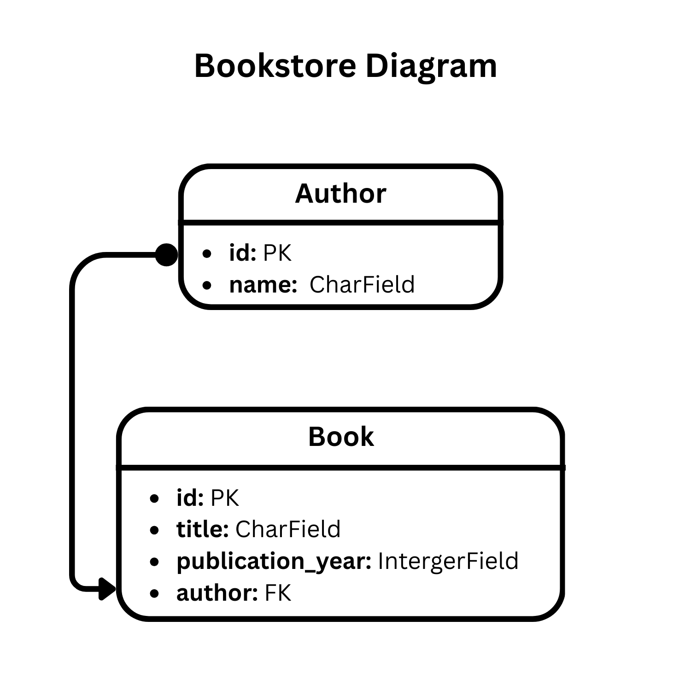

# BookStore Project 

## 1. Analysis Phase:
### Project Description
- We are creating a simple API for a bookstore that manages authors and books. This API will allow the user to perform basic CRUD operations (Create, Read, Update, Delete) on both authors and books. 

### Models
- Author
- book : where we are gonna link each book with an author (one author can create multiple book)

### Requirements
1. **Author:** (CRUD)
2. **Book:** (CRUD)
3. **Relationships:** 
    - each book must associated with exactly one author.
    - An author can have zero or more books.

4. **Fields:**
    - Author -> (name)
    - Book -> (title, author, publication_year)

5. **API Behavior:**
    - data validation

6. **General Instructions:**
    - No authentication or authorization needed we can do it later on.
    - Just use JSON for request and response.
    - we don't need to make the author name uniqe we can handel it with the ID.
---

## 2. Design Phase:
1. **Bookstore Diagram**

2. **Models:**
    - Author:
        - id: pk
        - name: CharField, max_lenght=255

    - Book:
        - id: pk
        - title: CharField, max_lenght=255
        - publication_year: IntegerField
        - author: FK, on_delete=CASECADE

2. **Endpoints Map:**
    - /api/authors/ : List and create authors.
    - /api/authors/<int:pk>/ : Retrieve, Update, or Delete a specific author.
    - /api/books/ : List and create authors.
    - /api/books/<int:pk>/ : Retrieve, Update, or Delete a specific book.
